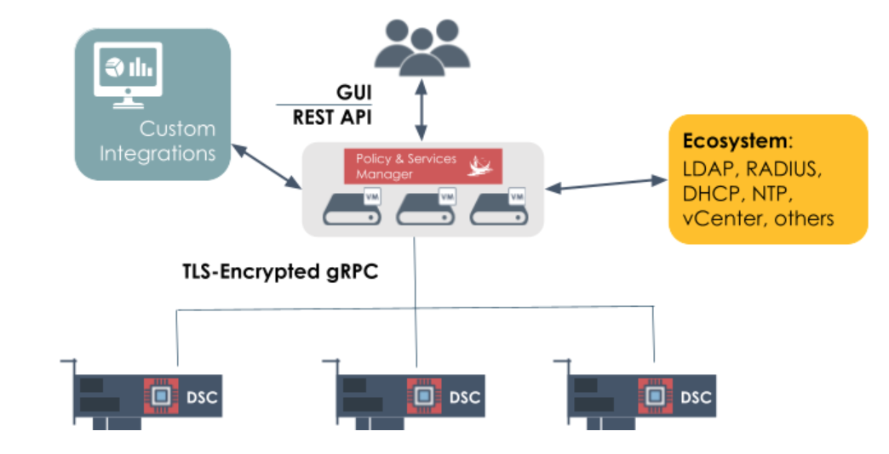

# Pensando Python Bindings
This repo contains the code-generated language bindings for the Pensando Policy and Services Manager (PSM).
For the Cloud pipeline bindings, please start [here](src_cloud/pensando_cloud/README.md)
For the Enterprise pipeline bindings, please start [here](src_end/pensando_ent/README.md)

Language bindings reflect the PSM REST API and are code-generated from the PSM schema, presented in Swagger format.
The REST API and the Swagger schema for any PSM pipeline is available dynamically through any PSM instance at **https://PSM-IPaddr/docs**
and **https://PSM-IPaddr/generated/swaggeruri.html** respectively.

## Using the PSM GUI to See API Examples
REST developers can take advantage of the fact that the PSM GUI itself uses the REST API. 
REST API calls sent from the GUI to the PSM as it implements the configurations created by the user can be displayed using the API Capture feature.  
API Capture is accessible from the “Admin” menu item on the PSM GUI screen.    
On the API Capture screen, click the “Enable Live Capture” button in the upper right, to enable Live Capture.  

## Pensando PSM Overview
The Pensando PSM is the central management component of the Pensando Distributed Services Platform. 
It provides a programmable, secure microservice-based infrastructure to control global policies and distributed services in a data center, such as Network, Security and  Storage services.
The PSM platform consists of an odd number of quorum controller nodes (e.g. 3, 5, 7) that provide consistent services to thousands of physical devices utilizing Pensando Distributed Services Cards (DSCs).  
The following figure is an architectural diagram of the PSM platform. 

